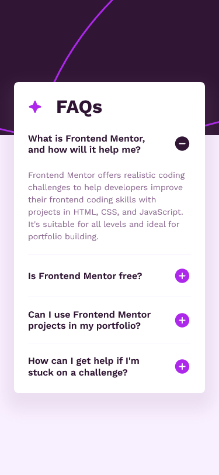
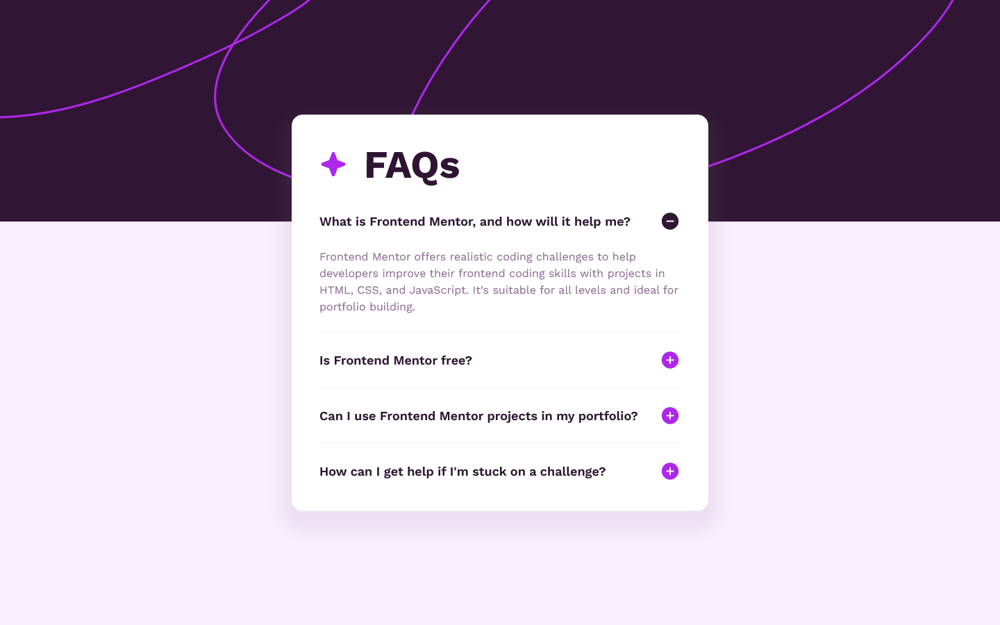

# Frontend Mentor - FAQ accordion solution

This is a solution to the [FAQ accordion challenge on Frontend Mentor](https://www.frontendmentor.io/challenges/faq-accordion-wyfFdeBwBz). Frontend Mentor challenges help you improve your coding skills by building realistic projects.

## Table of contents

- [Overview](#overview)
  - [The challenge](#the-challenge)
  - [Screenshot](#screenshot)
  - [Links](#links)
- [My process](#my-process)
  - [Built with](#built-with)
  - [What I learned](#what-i-learned)
  - [Useful resources](#useful-resources)
- [Author](#author)

## Overview

### The challenge

Users should be able to:

- Hide/Show the answer to a question when the question is clicked
- Navigate the questions and hide/show answers using keyboard navigation alone
- View the optimal layout for the interface depending on their device's screen size
- See hover and focus states for all interactive elements on the page

### Screenshot

#### Mobile solution



#### Desktop solution



### Links

- Solution URL: [Click here](https://github.com/JustANipple/faq-accordion)
- Live Site URL: [Click here](https://justanipple.github.io/faq-accordion/)

## My process

### Built with

- Semantic HTML5 markup
- CSS custom properties
- Flexbox
- CSS Grid
- Mobile-first workflow

### What I learned

To make a background that scales well with breakpoints, I used the following code:

```html
<div
  aria-hidden="true"
  class="absolute left-0 top-[-1px] h-[232px] w-[100vw] bg-e_patternMobile bg-cover bg-no-repeat sm:h-[320px] sm:bg-e_patternDesktop"
></div>
```

This makes it possible to cover the entire width of the viewport.

### Useful resources

- [TailwindCSS](https://tailwindcss.com/docs/installation) - Great docs from tailwindCSS to make styling easier.
- [Box shadow generator](https://html-css-js.com/css/generator/box-shadow/) - With this i was able to generate a box shadow that could fit well with the design.

## Author

- Frontend Mentor - [@JustANipple](https://www.frontendmentor.io/profile/JustANipple)
